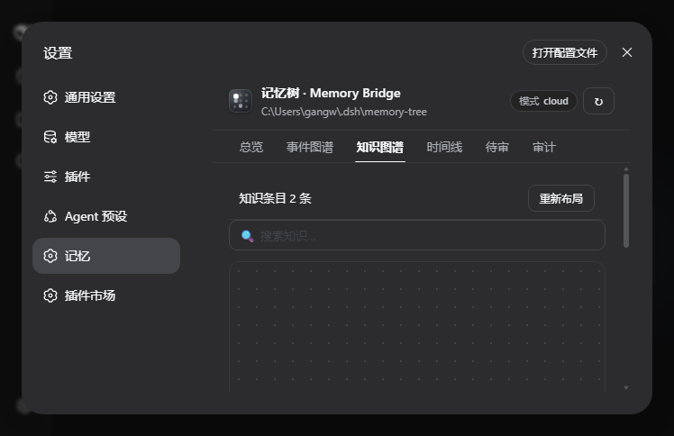
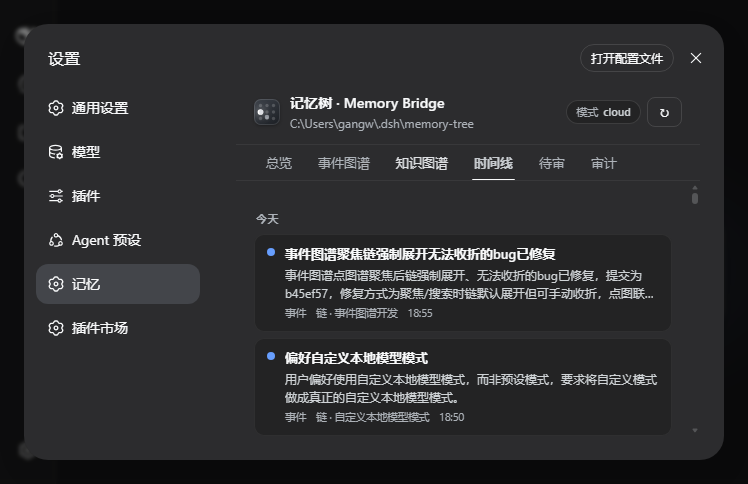

# dsh-memory-bridge

Memory Tree 桥接插件 —— 为 DeepSeek Harness 接上「记忆树系统」：自动写入（提取）+ 自动读取（注入）+ 检索/落盘记忆、管理记忆树、驱动本地/云端记忆提取，并配套高图形化设置页 UI。

## 架构

```
DeepSeek Harness (host 插件进程)
├── lib/index.js          host 入口：拉起 sidecar、注册 /dsh-memory/* 路由、注册 3 个 agent 工具、
│                         自动提取钩子（turn/end）、自动注入钩子（user/message → system prompt context）
├── python/memory_bridge_server.py   sidecar：JSON-RPC over HTTP，承载记忆树引擎 + 衰减治理 + lemonade
├── engine/               记忆树引擎源码（core/ + memory/，依赖声明式安装，见下）
└── client/client.js      设置页 UI（6 个 tab：总览 / 事件图谱 / 知识图谱 / 时间线 / 待审 / 审计）
```

- **记忆引擎**：随插件携带 `engine/`（明文 markdown 真源 + SQLite 检索索引 + BM25/RRF 确定性检索，零外部服务依赖）。
- **Sidecar 生命周期**：由 host 随插件启停自动托管。**lemonade 仅在 `local`/`hybrid` 模式的默认预设轨被拉起**（可选本地推理后端）；`cloud` / `main` / `local`+`preset=custom` 模式完全不依赖 lemonade——没有 lemonade 的用户选 `cloud`（云端提取）或 `custom`（任意 OpenAI 兼容本地端点，如 Ollama/LMDeploy）即可。
- **引擎路径解析**（无需硬编码，优先级从高到低）：`DSH_MEMORY_BRIDGE_ENGINE_ROOT` 环境变量 → 插件配置 `engineRoot` → 自动探测 `engine/`（本包内）→ 同级 `Memory Tree System/`（开发布局）。Python 可执行文件同理：`DSH_MEMORY_BRIDGE_PYTHON` → 配置 `pythonExe` → `python`（PATH）。

## 设计理念

记忆系统是长期增强（Long-Term Memory），不是聊天日志的简单堆积。本插件的四条核心设计原则：

1. **明文可读为真源，索引只做加速**。每张记忆卡都是一个可读的 markdown 文件（`events/cards/<id>.md`、`events/chains/<id>.md`），SQLite 只是检索索引。真源可读、可改、可人工修剪，索引可随时重建——不存在"数据锁死在数据库里"的黑盒。即使数据库损坏，记忆本体仍完整保留在 markdown 里。

2. **检索确定性优先，绝不"幻觉式召回"**。记忆检索用 BM25 + 多路 RRF 融合（FTS5 全文索引 + 短语匹配 + 反馈权重 + 链/实体/时间列），**零 LLM、零网络、零向量库**。结果可复现、可解释、可审计——同一条查询永远返回同样的卡。LLM 只用于"写入端"（从对话提取记忆），不参与"读取端"（检索），把不确定性关在写入管道里，用 `pending` 待审兜底。

3. **提取主动写，注入克制读**。写入端：每轮对话 `turn/end` 自动提取，agent 也可显式 `memory_add_run` 主动入队（双通道）。读取端：按对话意图分档注入——L2 关键事实 ≤3 条、L1 一般 ≤1 条、寒暄 L0 零注入，50ms 超时宁缺勿滥。**记忆是给模型"按需翻阅"的，不是无脑塞进每轮上下文**。

4. **遗忘是记忆的一部分**。没有治理的记忆库会膨胀成噪音。30 天闲置的枝自动完结、子卡枯萎（排除检索但保留数据）；注入利用率低时全局收缩注入条数；连续未被利用的卡降权淡出。遗忘由规则驱动（零 LLM），可解释、可翻查、可人工恢复。

## 关键决策与取舍

| 决策 | 取舍 | 理由 / 反例 |
|---|---|---|
| markdown 真源 + SQLite 索引 | 牺牲一点查询性能，换取可读/可修/可迁移 | 纯数据库方案（如直接存 SQLite 全文）数据不透明、难以人工核对；纯文件方案（全量扫 md）检索慢 |
| BM25+RRF 确定性检索 | 放弃向量/embedding 的语义召回，换取确定性、零成本、零外部依赖 | 向量库需要模型服务常驻 + 数据漂移不可复现；记忆检索是"精确回看"，不是"语义联想"，BM25 对中文（jieba 分词 + FTS5）足够 |
| 提取与注入分离（写 LLM / 读规则） | 写入质量依赖 LLM，读取完全确定性 | 读取若也用 LLM 会引入幻觉与不可复现，且每轮多一次模型调用 |
| turn/end 自动提取 + `memory_add_run` 显式通道 | 自动提取可能误采，显式通道依赖模型判断 | 双通道互补：自动覆盖"忘记录入"的轮次，显式覆盖"用户明确要求记住"的轮次（可指定 tier） |
| 分层注入 L0/L1/L2 | 寒暄轮几乎零注入，关键轮最多 3 条 | 无脑全量注入会污染上下文、稀释注意力、浪费 token；分档按对话意图动态判定 |
| 审计闭环 + 衰减治理 | 治理依赖"注入是否被利用"的启发式判定 | 记 `inject_used` 需要模型回复作为信号，启发式不完美，但比"永远不治理"强；误伤由 `rendered` 标记与 pending 兜底 |
| 30 天闲置完结 + 枯萎保留数据 | 完结枝不再参与检索，但文件保留可翻看 | 硬删除会丢历史且不可逆；完结后子卡 `status=wilted`、`weight` 降权 |
| sidecar 进程隔离（host JS + Python sidecar） | 多一个进程，换取引擎语言自由与故障隔离 | Python 引擎生态（jieba/SQLite/LLM 客户端）成熟；sidecar 崩溃只影响记忆功能，不拖垮 harness |
| 声明式 Python 依赖（不内嵌 jieba、不静默 pip install） | 安装多一步 `install-deps.ps1`，换取安全与可控 | 静默 pip install = 在用户机器执行任意代码；内嵌 39MB 第三方库膨胀仓库。缺失时 sidecar 返回可操作指引而非崩溃 |
| 路径自动探测（env → config → 探测） | 默认值不写死机器路径，换取出厂即用 | 硬编码 `D:\dsh\...` 会让别人拉取后直接启动失败；探测失败时给明确错误 |
| `apiKeyEnv` 渐进迁移 | 明文 key 仍可配（向后兼容），环境变量优先 | 明文密钥不应落盘入库；`.gitignore` 排除 `config.json`，仓库只带无密钥模板 |
| 同源校验分档 + 本地标记 header | 浏览器 fetch 需带 `x-dsh-memory: 1`，换取防跨站状态污染 | 只读 GET 带统计副作用（search 会记 usage），无 Origin 时必须带自定义 header（跨站 ``/`<script>` 带不了）|

## 安装（官方路径）

要求：DSH 0.1.0-rc.7+、Python 3.10+（本插件无 Node 原生依赖）。

```bat
:: 1) 从 GitHub 安装（替换 <owner> 为仓库所属用户）
dsh plugin --profile web add github:<owner>/dsh-memory-bridge

:: 2) 安装 Python 依赖（jieba 分词，声明式；清华镜像，失败自动回退阿里云）
pwsh <你的插件目录>/engine/install-deps.ps1
:: 等价于：pip install -r <插件目录>/engine/requirements.txt
```

重启 harness 后生效。卸载：

```bat
dsh plugin --profile web remove dsh-memory-bridge
```

> **依赖策略**：Python 依赖（jieba）走声明式安装，不随仓库内嵌、也不在安装时静默 pip install（安全 + 可控）。sidecar 对缺失依赖有容错：返回可操作的安装指引（`pip install -r engine/requirements.txt`），不会拖垮整个 harness。

## 配置（设置页 → 插件 tab）

| 项 | 说明 |
|---|---|
| 模式 mode | `off` 关闭 / `local` 本地模型 / `cloud` 云端记忆 API / `main` 主对话模型兜底 / `hybrid` 本地优先+云端兜底 |
| local.preset | 本地模型预设（默认 `qwen3-it-4b-flm`），或 `custom` 自填 baseUrl/model/apiKey |
| local.autoManage | 仅默认预设轨生效：开启后 health check 自动拉起本地推理服务并加载对应模型；`preset=custom` 时由你自填的 baseUrl/model 决定（不碰 lemonade） |
| cloud.* | 云端记忆 API（baseUrl / model / apiKey / apiKeyEnv / batchSize / maxCallsPerMinute） |
| sanitize | 提取前脱敏（手机号/邮箱/身份证/密钥），云端默认开启 |

- **API key 支持 `apiKeyEnv`**：配置 `apiKeyEnv` 指定环境变量名后，优先读环境变量，回退明文 `apiKey`（渐进迁移：设了环境变量即可删除明文 key）。
- API key 在配置回读时一律脱敏显示（`masked_config`）。
- 配置先校验后落盘（`configSet` 校验失败不写入），写入持单锁，无死锁。
- 仓库只提供 `config.example.json` 模板（无密钥）；首次运行无 `config.json` 时自动使用内置默认配置。

### 模型选择建议（重要）

记忆提取/注入用**小参数量的非思考（non-thinking）模型**质量最稳，原因：

- **思考 token 会污染提取结果**：reasoning 模型（如 deepseek-reasoner、开启 thinking 的 qwen3）输出含推理链，提取器按 JSON 结构解析时容易把思考内容当正文，导致标题/摘要漂移、归链错乱。
- **默认预设已关闭思考**：`qwen3-it-4b-flm` 预设内置 `enable_thinking: False`（qwen3 专用参数，见 `memory/backends.py` 的 LOCAL_PRESETS），无需手动处理。
- **custom 预设请选非思考变体**：例如 Ollama 的 `qwen2.5:7b`（无思考模式）、LMDeploy/vLLM 部署的 `qwen2.5-7b-instruct`（instruct 版，非 think 版）。若你的端点模型默认开思考，请在模型名/服务端配置关闭（`extra_body` 支持透传模型特有参数，如 `chat_template_kwargs.enable_thinking`，但不同模型参数名不同，请按服务端文档配置）。
- **云端**：默认 `deepseek-chat` 即为非思考对话模型，不要换成 `deepseek-reasoner`；其他 OpenAI 兼容服务同理选非 reasoning 端点。

## UI（设置页 → 记忆）

| Tab | 内容 |
|---|---|
| 总览 | 统计 / 状态 / 审计摘要 / 最近活动 |
| 事件图谱 | 力导向图 + 记忆树导航联动（点树聚焦图、点图按图过滤树）、孤立节点/实体关联开关、方向箭头流动线 |
| 知识图谱 | wiki 条目力导向图（上位/版本关系）+ 搜索 + 条目列表 |
| 时间线 | 事件流按日期分组（今天 / 昨天 / 2-6 天前，更早归入"更早"），时间倒序 |
| 待审 | 提取队列 / pending 经验审批 |
| 审计 | 注入/提取统计 + 「立即维护」按钮（手动衰减+治理）+ 决策日志 |

## 界面预览

> 设置页 → 记忆（`/settings` 内）。截图来自真实运行实例（事件 147 / 链 34 / 注入利用率 93%）。

| | |
|---|---|
| **总览**：统计卡片 / 记忆构成环形图 / 本地推理状态 / 提取注入审计 / 提取配置表单 | **事件图谱**：力导向图（方向箭头、链着色）+ 下方记忆树联动导航 |
|  |  |
| **知识图谱**：wiki 条目力导向图（上位/版本关系）+ 搜索 + 条目列表 | **时间线**：事件流按日分组（今天/昨天/2-6 天前），时间倒序 |
|  |  |

## Agent 工具

| 工具 | 用途 |
|---|---|
| `memory_search` | BM25+RRF 确定性检索记忆卡，零 LLM、零网络；返回链上下文与反馈信号提示 |
| `memory_add_run` | 由 agent 在对话中主动调用（如用户要求记住某事、或判断本轮有持久价值）：把传入的 userText（取自 harness 会话原文）写入 run 队列，之后由 rules/LLM 提取决定是否成卡；可指定 tier 优先级 |
| `memory_review` | 查看待提取 run 队列 / 指定 run 状态，用于审计 |

## HTTP API（浏览器代理，host 转发到 sidecar）

- `GET  /dsh-memory/overview` `health` `search?q=` `browse?kind=` `card?id=` `review?runId=` `wiki?q=` `config` `lemonade-status` `audit` `graph`（只读，需带 `x-dsh-memory: 1` header 或同源 Origin，见安全）
- `POST /dsh-memory/card-action` `add-run` `config` `lemonade-ensure` `extract` `maintenance`（写操作，同源校验）
- `inject` / `recordUsage` 不暴露为 HTTP 路由：宿主插件在事件钩子（user/message 预取、turn/end 审计）内部直连 sidecar 调用，浏览器不可直接触发。

## 安全

- **同源校验**：POST（写操作）严格校验 Origin（浏览器同源 POST 必带，不匹配即 403）；GET（只读）——带 Origin 的必须匹配（防跨站读取），**无 Origin 时必须携带本地标记 header `x-dsh-memory: 1`**（跨站 ``/`<script>` 无法自定义 header，从而挡掉只读检索附带的统计副作用）。UI 的 fetch 均带该 header。
- 云端提取前默认脱敏；`apiKey` 永不回显明文，支持 `apiKeyEnv` 环境变量。
- Sidecar 仅监听 127.0.0.1 随机端口，不暴露公网；RPC body 上限 1MB；hook 调试日志 1MB 轮转（异步低频检查，不阻塞会话热路径）。

## 开发与测试

```bat
REM 独立启动 sidecar（脱离 harness 联调；--root 指向引擎目录）
python -u <插件目录>\python\memory_bridge_server.py --root <引擎目录> --config <插件目录>\config.example.json
```

启动后读 stdout 的 `DMB_PORT <port>`，然后：

```powershell
Invoke-RestMethod "http://127.0.0.1:<port>/rpc" -Method Post -Body @{method="overview";params=@{}} | ConvertTo-Json
```

一键冒烟测试（双场景：bundled engine 缺 jieba → 验证可操作指引；本地引擎 → 全功能）：

```bat
python smoke_sidecar.py
```

记忆引擎测试（独立于 harness，需要 `pip install pytest`）：

```bat
python -m pytest <引擎目录>\tests -q
```

启动器 `D:\dsh\DSH.bat`（纯 ASCII，任何终端无乱码）：单窗口后台启动 / 停止 / 状态 / 重启（含端口释放等待、日志轮转、启动检测）。
