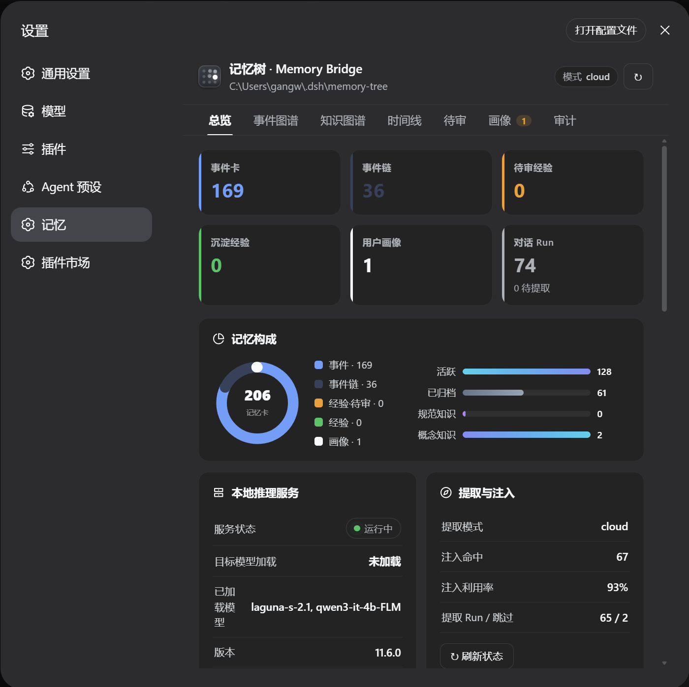
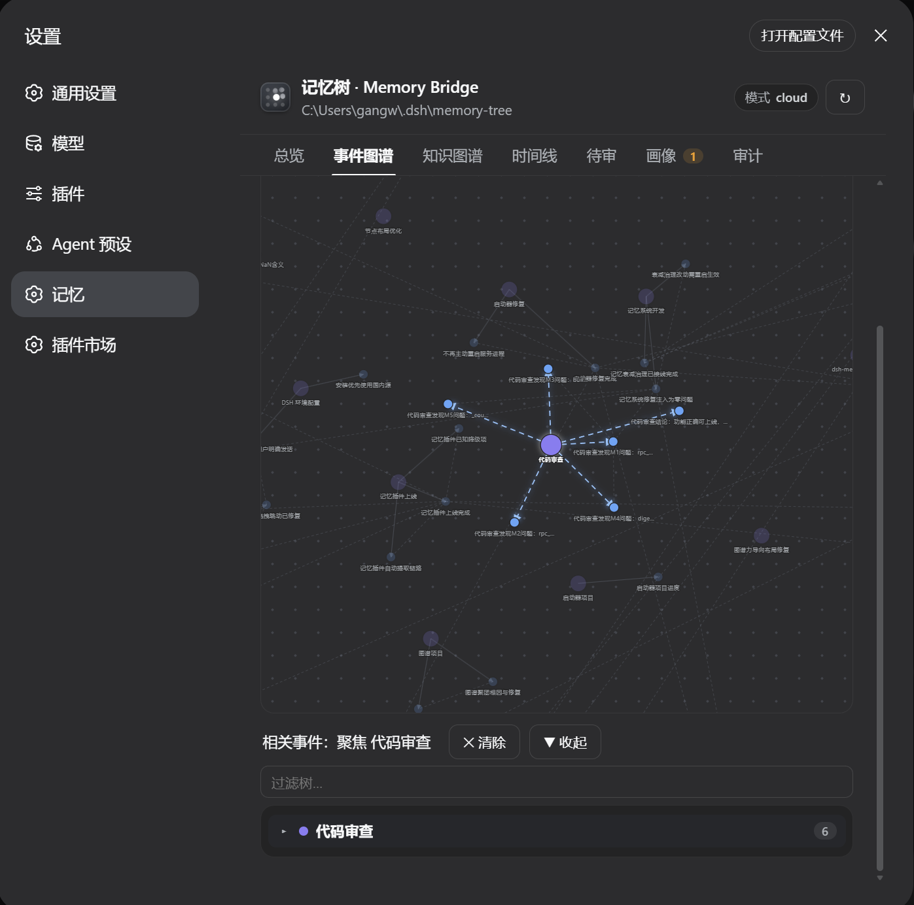
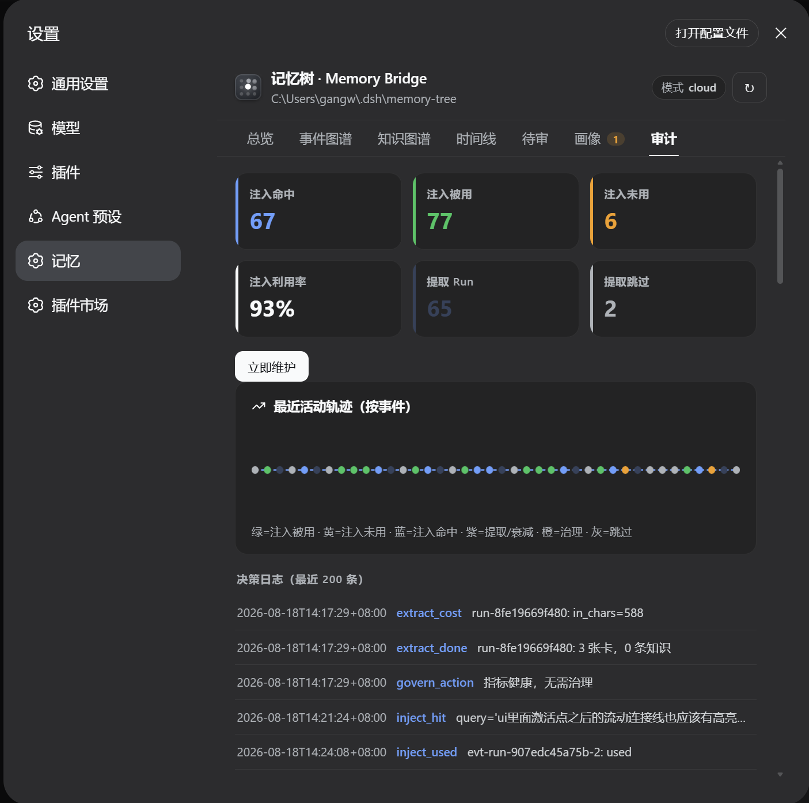

# dsh-memory-bridge

[English](README.en.md) | 中文

为 DeepSeek Harness 提供**长期记忆**的桥接插件：对话自动沉淀为可检索、可审计、可治理的记忆树，并在后续对话中按需注入上下文。它最初是一个**可进化的私人记忆系统**——面向个人使用而设计，现在开源出来给有兴趣的人自取。

- 存储：明文 Markdown 真源 + SQLite 索引（可读、可修、可迁移）
- 检索：BM25 + 多路 RRF 相关度排序召回（零 LLM、零外部服务）
- 治理：遗忘曲线、审计闭环、全局收缩——记忆会老化但可解释
- UI：设置页内 7 个可视化 tab（总览 / 事件图谱 / 知识图谱 / 时间线 / 待审 / 画像 / 审计）

---

## 项目定位

**核心适用场景：上下文窗口受限的记忆系统。**

DeepSeek 云端模型（V4）提供 **100 万 token 的上下文窗口**（[公开资料](https://www.orcarouter.ai/blog/deepseek-v4-review)），在这个前提下，DSH 自带的机制（resume 恢复整个会话 + compaction 压缩超长上下文）足以维持记忆——"把历史都塞进窗口"是可行的。

但**一旦接入本地模型**（Ollama 等），情况完全不同：上下文窗口通常是 **4K-32K，且需显式配置、性能随长度显著下降**（[Ollama 文档](https://docs.ollama.com/context-length)）——窗口缩小几十倍，"把历史都塞进去"不再可行。**这时候记忆必须结构化、可检索、按需注入**，而不是依赖长上下文硬扛。

**本插件解决的正是这个实用场景**：

> 当上下文窗口受限（本地模型 / 小窗口模型）时，如何仍然拥有可用的长期记忆？

方案：把对话中值得留存的（你是谁、做过什么、哪些决定被认可、哪些经验被验证）**提取、结构化、存储**，在每轮对话中**只注入相关的几条**（而非全部历史）。即使窗口很小，记忆依然可用。

**与 DSH 原生上下文的关系（边界说明）**：

| 场景 | DSH 原生行为 | 本插件的角色 |
|---|---|---|
| **新会话** | 历史为空 | 插件注入是**唯一的跨会话记忆来源**（核心价值）|
| **resume 旧会话** | 全部历史重放进上下文 | 插件注入**叠加**在历史上（不替代）；两者并行占窗口 |
| **长会话超窗** | compaction 压缩历史为摘要 | 插件注入**补充**摘要缺失的细节（互补）|

> **明确的边界**：本插件注入的是 **system prompt 中的动态上下文**（`systemPrompt.context`），**不替代、不抑制 DSH 的会话历史注入**（历史由 dsh-session 的 `deriveMessages` 全量生成，插件无 API 裁剪）。**会话内的历史瘦身是 DSH compaction 的职责**，本插件负责的是**跨会话的持久事实**——两者互补，不重叠。

**用户群体**：

| 群体 | 使用方式 |
|---|---|
| **本地模型用户** | 上下文窗口小（4K-32K），最需要"按需注入"而非"全量塞入"——核心场景 |
| **DeepSeek 云端用户** | 1M 窗口下是"锦上添花"：获得结构化检索、治理、可视化，而非靠窗口硬扛 |
| **记忆敏感用户** | 明文存储 + 完整溯源 + 人工审批通道，数据透明可控 |
| **开发者 / 自托管者** | 引擎与桥接分离、零外部服务依赖、可二次开发 |

**边界声明**：这是一个**记忆基础设施**，不是"记忆完美的智能体"——提取质量依赖所选 LLM，检索是**相关度排序召回**（非语义联想，也有多跳扩展），这些取舍在"已知局限"中如实说明。

---

## 在 Harness 中：提供什么 · 解决什么 · 价值

### 提供什么（能力清单，站在使用者视角）

| 能力 | 怎么用 |
|---|---|
| **跨会话持久记忆** | 对话自动沉淀为记忆卡，后续会话按需检索注入——补足 DSH 会话上下文之外的持久事实层 |
| **记忆检索工具** | agent 可用 `memory_search` / `memory_add_run` / `memory_review` 三个工具主动读写记忆 |
| **记忆可视化** | 设置页 7 个 tab：事件图谱、知识图谱、时间线、待审、画像、审计、总览 |
| **经验与画像** | "记住教训/踩坑"立即沉淀永久经验；偏好信号聚合提案；画像蒸馏 + 人工审批 |
| **治理闭环** | 遗忘曲线、利用率收缩、审计反馈——记忆库不无限膨胀 |

### 解决什么（痛点）

| 痛点 | 本插件的解法 |
|---|---|
| **跨会话记忆缺失**：新会话/压缩后不携带旧事实，resume 只能续旧对话 | 自动提取沉淀到持久层，注入相关记忆恢复背景（跨会话的持久事实，非会话内历史）|
| **窗口小存不下全部记忆**：本地模型 4K-32K 塞不下全部历史；会话内超长由 DSH compaction 处理，跨会话事实由本插件按需注入（分档限量）| 只注入相关的几条记忆（L2≤3/L1≤1/寒暄 0），避免把全部历史塞进提示词 |
| **历史不可检索/治理**：会话日志是流水文本，不可查"我之前说过什么偏好" | 结构化记忆卡 + 相关度排序检索 + 分档注入 + 治理闭环 |
| **记忆不可信**：模型"记得"可能是幻觉 | 检索零 LLM 相关度召回；写入带证据标签 + 溯源；低置信走人工审批 |
| **数据黑盒**：记忆锁在数据库/向量库里，不可读不可改 | 明文 Markdown 真源，可读可修可迁移 |
| **记忆库膨胀**：越积越多，噪音淹没信号 | 遗忘曲线（30 天闲置完结）+ 利用率治理 + 降权淡出 |
| **投入产出不明**：装了记忆插件不知道有没有用 | 审计 tab：注入命中率 / 利用率 / 提取成本，闭环可量化 |

### 价值

- **对对话质量**：关键轮次注入相关记忆（偏好、项目背景、既定决策），减少重复说明与前后矛盾——模型基于检索到的记忆回应，而非凭空"记得"。
- **对成本**：注入按需限量 + 寒暄零注入 + 提取门卫（寒暄轮跳过 LLM 提取），记忆不成为每轮的 token 负担；KV-cache 友好（常驻基线 digest 未变不重建）。
- **对可靠性**：记忆是独立数据层而非模型自律——检索可复现、写入可溯源、治理可审计；即使提取失败，原始对话永远在 `runs` 表。
- **对掌控感**：数据明文在本地，可人工编辑/删除；经验与画像经人工审批才固化；全部决策写 `decision_log`。

---

## 设计理念

**一句话：记忆是独立可靠的数据层，不是模型自律的产物。**

四条原则：

1. **明文为真源，索引只做加速**。每张记忆卡是一个 Markdown 文件，SQLite 只是可重建的检索索引——数据不锁死、可人工编辑、索引坏了不丢数据。
2. **确定性算法检索，读取端零 LLM**。读取端（检索）零 LLM：BM25 + 多路 RRF 融合，同一数据状态下结果可复现、可审计。LLM 只参与写入端（从对话提取），不确定性被关在写入管道里。
3. **提取主动写，注入克制读**。每轮对话自动提取（LLM + 零 LLM 规则双通道）；注入按对话意图分档（关键 ≤3 条、一般 ≤1 条、寒暄 0 条），记忆是"按需翻阅"不是"无脑塞进上下文"。
4. **遗忘是记忆的一部分**。30 天闲置枝完结、低利用卡降权、关键事实豁免——遗忘由规则驱动，可解释、可翻查、可恢复。

**记忆树形态**：记忆不是平铺列表，而是按时间生长的树——**枝 = 事件链（主题演进），叶 = 事件卡（发生了什么）**；事件完结生成"果摘要"作为导航路标；版本演化走 `supersedes` 时序链（旧事实失效但保留审计）；每条卡带溯源（来源文件 / 回合 / 证据标签 / 佐证计数），**可回到原始对话**。

**记忆与知识分离**：`memory-tree`（关于"你"的经历）与 `memory-wiki`（关于"世界"的规范）是两个独立库，知识条目不进记忆树，避免污染画像与经历。

---

## 重大决策

| 决策 | 选择 | 理由（反对方案） |
|---|---|---|
| 记忆存储 | Markdown 真源 + SQLite 索引 | 纯数据库不可读不可人工核对；纯文件检索慢。双写兼顾透明与速度 |
| 检索算法 | BM25 + RRF（jieba 分词 + FTS5）| 向量库需模型常驻、结果不可复现、依赖外部服务；词级相关度排序 + 多跳扩展对记忆场景足够且可审计 |
| 写入管线 | LLM 提取 + 零 LLM 规则（双通道）| 单一 LLM 提取慢且贵；规则通道让"记住/踩坑/偏好"即时落卡 |
| 读取注入 | 拉式检索 + 常驻基线，分档限量 | 全量注入污染上下文、稀释注意力 |
| 真值裁决 | LLM 只输出"证据标签"，系统算置信、做准入 | 模型自评当事实源会放大幻觉；directive/explicit 自动固化，uncertain 强制人工审 |
| 归链 | 确定性裁决（`resolve_chain`，别名/相似度/实体消歧）| 直接哈希 LLM 标题会因措辞漂移分裂成"同名假链" |
| 对话保底 | 原始对话先落盘 `runs` 表，幂等状态机 | 提取失败/禁用都不删原文——记忆管道出错，原始语料永远在 |
| 进程模型 | host JS + Python sidecar（进程隔离）| 引擎生态成熟；sidecar 崩溃只影响记忆，不拖垮 harness |
| Python 依赖 | 声明式（`install-deps.ps1`），不内嵌、不静默安装 | 静默 pip install = 在用户机器执行任意代码 |
| 密钥 | `apiKeyEnv` 环境变量优先，明文回退兼容 | 明文 key 不落盘入库；`.gitignore` 排除 `config.json` |

---

## 关键工程实现

### 架构

```
DeepSeek Harness (host 插件进程)
├── lib/index.js                宿主：拉起 sidecar、HTTP 路由、agent 工具、
│                               事件钩子（自动提取 / 零 LLM recorder / 注入 / 审计闭环）
├── python/memory_bridge_server.py  sidecar：JSON-RPC over HTTP（127.0.0.1 随机端口），
│                                   承载引擎、衰减治理、画像蒸馏
├── engine/                     记忆树引擎源码（core/ + memory/，依赖声明式安装）
└── client/client.js            设置页 UI（7 tab，浏览器直连 host 代理）
```

### 存储层：明文真源 + 幂等写

- 卡 = Markdown 文件（front matter 元数据 + 正文），目录按类型分（`events/cards`、`events/chains`、`lessons/pending`、`lessons/permanent`、`profiles`）
- 全部写操作幂等（同 id 覆盖 / `INSERT OR IGNORE`），崩溃重启对账（`extracting` 回滚为 `staged`）
- 溯源字段贯穿：`source_path`（文件）、`trace_event_id`（回合）、`evidence`（证据标签）、`corroborations`（佐证）

### 写入管线（双通道）

1. **LLM 提取**（turn/end 自动）：增量扫本轮 user+assistant 文本 → 入 `runs` 队列 → 门卫 `should_extract`（零 LLM，寒暄轮标记 skipped 省调用）→ LLM 提取 → 事件卡/经验/知识分流落库 → 归链 → 冲突裁决 → 失败退避。JSON 输出有截断容错（补引号/插逗号/补闭合括号）。
2. **零 LLM 规则 recorder**（user/message 即时，纯规则不抢 TTFT）：
   - "记住教训/踩坑/经验教训" → **立即 lesson_permanent**（永久经验）
   - "记住/记下/别忘了" → 立即事件卡
   - "我喜欢/习惯/别用" → 偏好信号入账 → 聚合 ≥3 同类 → lesson_pending 提案

### 读取管线（注入 + 审计闭环）

- **user/message 预取**：检索相关记忆（L2 ≤3 / L1 ≤1 / 寒暄 L0 零注入，50ms 超时宁缺勿滥）+ **常驻基线快照**（approved 画像 + 高置信永久经验，digest 变更检测、KV-cache 友好）→ 缓存 → system prompt 渲染时注入带溯源文本
- **审计闭环**：turn 结束后判定注入是否被回复利用（规则归因零 LLM）→ 命中滚动 / 连续 ≥3 次未命中降权淡出（"没被利用" ≠ "记忆错误"）

### 生命周期治理（规则驱动，零 LLM）

- **遗忘曲线**：30 天闲置枝自动完结、子卡枯萎（`status=wilted`、排除检索但保留数据）
- **全局治理**：`inject_used_rate < 0.3` → 自动收缩注入条数（3→2→1）；动作写 `decision_log` 可审计
- **安全豁免**：lesson_permanent / approved / explicit / directive / 佐证 ≥1 的卡豁免衰减

### 画像蒸馏

- 手动触发（UI「画像」tab 或 RPC `distill`）：收集事件树 → LLM 生成画像摘要 + 用户人格维度（MBTI + 8 轴，属画像数据而非 persona 库）→ 防抖/去重 → 草稿 → **人工采纳**固化（version+1，草稿移入 `approved/` 防重复采纳）→ 进入注入常驻基线
- 画像 = 常驻注入的用户画像信息：每轮对话的 system prompt 携带画像摘要（身份/偏好/协作方式），作为模型的稳定用户背景

### 工程保障

- **故障隔离**：sidecar 崩溃只影响记忆，不拖垮 harness；jieba 缺失时返回可操作安装指引而非崩溃
- **安全**：POST 严格同源校验；GET 无 Origin 须带本地标记 header（防跨站状态污染）；RPC 参数路径穿越白名单；Sidecar 仅监听 127.0.0.1；密钥脱敏回显 + `apiKeyEnv` 渐进迁移
- **可移植**：引擎路径自动探测（env → config → 自动），Python 可执行文件同理；无 Node 原生依赖
- **可测试**：独立冒烟脚本（真实 spawn sidecar）、引擎 324 个单元测试、JSON 修复器专项用例

---

## 特色

- **为受限上下文而生**：本地模型窗口 4K-32K 也能有可用的长期记忆——注入只带相关几条，不靠大窗口硬扛（云端 1M 窗口下同样省 token）
- **本地零外部服务**：读取端（检索/注入/治理）零 LLM、零向量库、零外部依赖；写入端可选本地模型或云端 API（mode 决定）
- **记忆与知识分离**：记忆 = 关于"你"的经历（会变、有时效）；知识 = 关于"世界"的规范（稳定、可复用）。**分开存是为了检索不被污染**——搜规范时不会翻出私人经历，反之亦然；两者检索策略也不同（记忆 BM25+RRF，知识条文级倒排）
- **树状组织、弱图谱关系**：事件按**链**聚合（枝=主题演进，叶=单次事件）。树是**确定性归链**（resolve_chain，标题/别名/实体消歧），图谱只是树的可视化投影——不强依赖实体关系网（实体关系提取难且不稳），用确定性的"归属链"组织记忆
- **记忆会"生长"**：事件 → 事件链 → 经验 → 画像的蒸馏路径，不是日志堆积
- **双通道写入**：LLM 提取的广度 + 规则即时响应的速度（"记住教训"立即沉淀）
- **克制注入**：按意图分档 + 常驻基线 + 审计反馈，控制注入量、避免占满上下文
- **可视化**：力导向事件图谱 / 知识图谱 / 时间线，图谱与树联动

---

## 已知局限

**如实披露**（非 bug，是设计边界或未完成项）：

| 项 | 状态 | 说明 |
|---|---|---|
| 提取质量依赖所选 LLM | 设计边界 | 写入端用 LLM，选错模型（如 reasoner 思考模型）会污染提取；默认预设已关思考，文档有"非思考模型"选型建议 |
| 检索是词级相关度召回，非语义联想 | 设计边界 | BM25+RRF 按词命中相关度排序（含沿链/实体多跳扩展），对**措辞漂移**召回有限（靠别名/归链缓解），不适合"语义联想"类查询（如"和上次那个类似的东西"）|
| 画像蒸馏为手动触发 | 未完成 | `DistillWorker`（每周 + idle 门槛自动调度）已实现，sidecar 未启动后台线程，当前需手动点「蒸馏画像」 |
| `persona.py`（引擎内置人格库）| 刻意不接线 | agent 人格由 **DSH 侧 persona 插件/系统提示词**管理（引擎 README §9.5 明确不迁移清单）；本插件只负责"记忆"，不负责"分身人格" |
| 偏好信号需 ≥3 次同类提及才提案 | 设计边界 | 避免单次随口一说即沉淀；反复表达才入 pending |
| **无法替代会话历史全量重放** | 设计边界 | resume 旧会话时 DSH 会把全部历史重放进上下文，插件注入**叠加**在历史上、**无法替代或抑制**（历史由 dsh-session `deriveMessages` 全量生成，插件无裁剪 API）；会话内历史瘦身需靠 DSH compaction |
| 本地小模型边缘波动 | 设计边界 | 4B 级本地模型在规范条文/别名等边缘用例有波动，云端全绿，低置信走 pending 人工兜底 |

---

## 安装

### 适配版本

| 依赖 | 版本要求 | 依据 |
|---|---|---|
| DeepSeek Harness | **0.1.0-rc.7+** | 插件依赖 `@deepseek-ai/dsh-tools@^0.1.0-rc.7`，client 注入的 5 个服务（connection/runtime/locale/ui-settings/ui-theme）在 rc.7 下实测可用 |
| Python | 3.10+ | sidecar 使用 `X \| Y` 类型语法（3.10+）|
| Node 原生依赖 | 无 | 纯 JS host + Python sidecar |

> 说明：rc.7 之前的版本未验证（settings 挂载机制在 rc.7 有调整），建议使用 rc.7 及以上。

```bat
:: 1) 从 GitHub 安装
dsh plugin --profile web add github:<owner>/dsh-memory-bridge

:: 2) 安装 Python 依赖（jieba 分词，声明式；清华镜像，失败自动回退阿里云）
pwsh <你的插件目录>/engine/install-deps.ps1
```

重启 harness 后生效。卸载：`dsh plugin --profile web remove dsh-memory-bridge`

> 已带 `dsh-plugin` / `dsh-category-memory` topics——可从 **DSH 设置 → 插件市场（Marketplace）** 的 memory 分类下发现并一键安装。

> 依赖策略：jieba 走声明式安装，不内嵌、不在安装时静默 pip install；缺失时 sidecar 返回可操作指引，不拖垮 harness。

---

## 配置（设置页 → 记忆 → 提取配置）

| 项 | 说明 |
|---|---|
| mode | `off` 纯规则 / `local` 本地模型 / `cloud` 云端记忆 API / `main` 主对话模型兜底 / `hybrid` 本地优先·云端兜底 |
| local.preset | `qwen3-it-4b-flm`（推荐，内置关思考）或 `custom`（自填 baseUrl/model/apiKey/apiKeyEnv）|
| cloud.* | 云端记忆 API（baseUrl / model / apiKey / apiKeyEnv / batchSize / maxCallsPerMinute）|
| sanitize | 提取前脱敏（手机号/邮箱/身份证/密钥），云端默认开启 |

- **模型选择**：提取/注入用**非思考模型**最稳（reasoning 输出推理链会污染 JSON 提取）；默认预设已关思考；custom 请选 instruct 变体；云端用 `deepseek-chat` 勿用 `deepseek-reasoner`
- **API key**：`apiKeyEnv` 环境变量优先，回退明文；回读一律脱敏；配置先校验后落盘

---

## UI（设置页 → 记忆）

| Tab | 内容 |
|---|---|
| 总览 | 统计 / 状态 / 审计摘要 / 最近活动 |
| 事件图谱 | 力导向图 + 记忆树导航联动、孤立节点/实体开关、方向箭头流动线 |
| 知识图谱 | wiki 条目力导向图（上位/版本关系）+ 搜索 + 列表 |
| 时间线 | 事件流按日分组（今天/昨天/2-6 天前），倒序 |
| 待审 | 提取队列 / pending 经验审批 |
| 画像 | 已审批画像 + 「蒸馏画像」 + 草稿采纳/驳回 |
| 审计 | 注入/提取统计 + 「立即维护」 + 决策日志 |

## 界面预览

| | |
|---|---|
| **总览**：统计卡片 / 记忆构成 / 本地推理状态 / 提取注入审计 / 配置表单 | **事件图谱**：力导向图 + 记忆树联动导航 |
|  |  |
| **审计**：注入/提取统计 + 手动维护 + 决策日志 | |
|  | |

---

## Agent 工具

| 工具 | 用途 |
|---|---|
| `memory_search` | 确定性算法检索记忆卡（BM25+RRF，零 LLM），返回链上下文与反馈提示 |
| `memory_add_run` | agent 主动把当前轮写入 run 队列（可指定 tier）|
| `memory_review` | 查看待提取 run 队列 / 指定 run 状态 |

---

## HTTP API

- `GET`：`overview` `health` `search?q=` `browse?kind=` `card?id=` `review?runId=` `wiki?q=` `config` `lemonade-status` `audit` `graph` `profile-status`（需 `x-dsh-memory: 1` header 或同源 Origin）
- `POST`：`card-action` `add-run` `config` `lemonade-ensure` `extract` `maintenance` `distill` `distill-approve` `distill-reject`（同源校验）
- `inject` / `recordUsage` / `recorder` 不暴露为 HTTP 路由：宿主在事件钩子内部直连 sidecar

---

## 开发与测试

```bat
REM 独立启动 sidecar（脱离 harness 联调）
python -u <插件目录>\python\memory_bridge_server.py --root <引擎目录> --config <插件目录>\config.example.json

REM 冒烟测试（bundled engine 缺 jieba → 可操作指引；本地引擎 → 全功能）
python smoke_sidecar.py

REM 引擎单元测试（324 个）
python -m pytest <引擎目录>\tests -q
```
